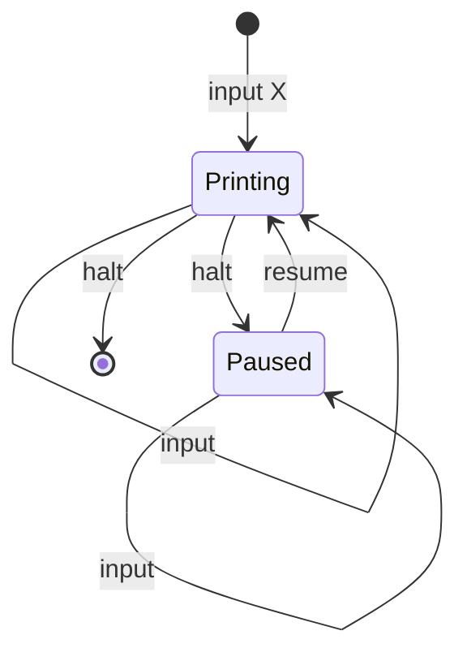

# The Event Machine (TEM)

## Initial thoughts:

Despite almost never using javascript or typescript in a OOP fashion, this problem will require classes. It has a runtime which is best managed internally. So I will make a class with methods that will act on the internal state of the app.

A state machine of the runtime is here:

### Global datum

`setInterval` is a way to handle events with node. But there is a limitation. It's not gauranteed to fire at the exact time that it is set.

For example, if I chain up 6 set timeout requests and prime them with 2 second intervals, I won't get a program that runs for 12 seconds. It is likely to be a few milliseconds longer.

I need to store the inital time that the program was started as a global datum. All future calculations will be made from this.

### Dropped events

If each event triggers the next event, the system isn't very robust. It might be safer to keep a bus of 5 events ready to fire at the desired intervals. Each time an event fires, it checks the bus and repopulates the bus back up to 5 events.
