# The incredible state machine

To start:

```
npm install
npm run app
```

Tests:

```
npm run test
```

## Initial Approach

I chose to do the CLI approach for user input and output. I've not done an interactive CLI app in a long, long time. It was a really interesting experience solving the problem of a runtime with user interupts and events combined with the management of a timer component as well.
Up front planning:

I decided on this kind of state.

```mermaid
stateDiagram-v2
direction LR
    [*] --> Initial: npm start
    Initial --> Running: input\ntimer interval
    Initial --> Initial: 💥 err
    Running --> Running: 💥 err
    Paused --> Paused: 💥 err
    Running --> Running: input\nnumber
    Running --> Paused: halt
    Paused --> Running: resume
    Running --> Terminated: quit
    Terminated --> [*]
```



And decided to use this pattern to build a state machine.
[building a typescript state machine](https://medium.com/@floyd.may/building-a-typescript-state-machine-cc9e55995fa8)
I've not done this from first principles before. It was overkill. By the end of it, I realised I had kind of made a react type cli framework. 😕

The rest of the solution is discussed below:

### State management and IO

The app starts with an injected readline Interface to handle user input and output. (This makes for easier testing).

The state is initialised and then then the runtime is started. The runtime consists of an event loop that reacts to "line", that is a new line from the user.

When user input is recieved:

- the `state` and the `input` are evaluated into an `action`.
- The `action` is applied to the `state` to produce a new `state`.
- Then any user feedback is sent.

### Timers

The timer is a weird one. I remember that node drifts a bit, see: [drifting](docs/compromises.md#drift) for details.
I did not account for this because I had issues managing global state with the timer.

I wish that I had time to implement a proper pause function, see: [pause](docs/compromises.md#pause-function). But the current timer just restarts from scratch.

### Testing

Testing the process input was extremely frustrating. I ended up injecting the readline interface to make this easier.
If I had more time, I might add unit tests to the states and actions. But it seemed a bit verbose for this exercise.

I've unit tested the helper functions and added a proper e2e test for the entire app flow.

### Fibonacci numbers

The 1000th term of fibonacci is way huge. 209 digits! It's not really safe to deal with integers of that size in javascript.
Integer limit: 9,007,199,254,740,991 (value)
String limit: 9,007,199,254,740,992 (characters)
When the app starts it calculates the first 1000 numbers. The fibonacci value is stored as a `string` in the key of a global map object.

- Quick to look up
- No concerns with rounding errors if it's a string comparison
- One off calculation when the app starts

## Questions:

1. You have a new requirement to implement for your application: its logic should stay exactly the same but it will need to have a different user interface (e.g. if you wrote a web app, a different UI may be a REPL). Please describe how you would go about implementing this new UI in your application? Would you need to restructure your solution in any way?

Currently the app is in CLI form.

It could be migrated to a web app UI with little change.
Readline is an IO interface. So we need to replace this IO interface with a web compatible implementation.
Instead of an event listener on readline, we would listen for user events from a button for example:

```
    const handleUserInput = (input) => {
    const action = handleIO(state, input);
    state = reduce(action, state);
    document.getElementById("display").innerHTML = prompt;
    };
```

In this snippet, the display element is updated at the end of each state update from a user input.
It would also make sense to pass in a callback to the timer, so it can update the page dynamically.

2. You now need to make your application “production ready”, and deploy it so that it can be used by customers. Please describe the steps you’d need to take for this to happen.

- Go with a Single page web app. I can't see the need for any backend for this application. Unless multiple people were supposed to share the same timer, or it was important to persist the user numbers between sessions. You really need the timer to be running in the browser.
- Any session persistance can be done with a a simple key in local storage.
- The architecture is that of a simple static webpage hosted on S3. Register a route on route 53. If you expect crazy traffic, you could cache it on cloudfrount. Seems overkill for such a light app though.
- Pick a front end. React, Angular, Vue, or even just plain html and compiled typescript.
- Add the repo to github. Add a staging and production environment.
- Run the unit tests on merges to main. Add a proper cypress or playwright test to the staging environemnt. It you really wanted to you could add synthetic tests in production with something like [checkly](https://www.checklyhq.com/).
- The deploy step is simple enough to be done with github actions and AWS code deploy. Or you can just upload the actual folder directly to AWS as a build step. (You would have to put keys into github with write access to the bucket to do this.)
- Logging would be useful. Unhandled and handled errors could be tracket with somthing like [Sentry](https://docs.sentry.io/platforms/javascript/?original_referrer=https%3A%2F%2Fsentry.io%2F).

3. What did you think about this coding test - is there anything you’d suggest in order to
   improve it?
   I got super nervous and also had way too much fun and really overengineered it. I'm not like this when I have an actual job and requirements and time deadlines 😁. I did really enjoy going down a rabbit hole of building a state machine from first principles and uncovering a heap of respect for what the react framework does for you.

I guess a guideline of what quality to aim for would be good.
Alternatively a statement that says: "This is not intended to be a production level application. If you make any compromises, or have TODOs that you would implement if you had more time, document them in your answer."

I wasn't sure whether to focus on the timer accuracy, or the IO and state machine, or the BigInt specifics of the fibonacci calculator. When I've written things like this in the past, I've sometimes given a the assignee a choice of what they want to focus on.
