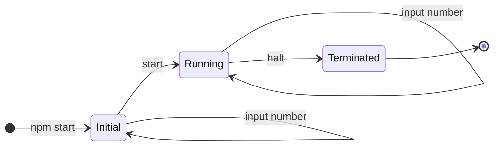

```mermaid
stateDiagram-v2
direction LR
    [*] --> Initial: npm start
    Initial --> Running: start
    Initial --> Initial: input name
    Initial --> Initial: input number
    Running --> Running: input name
    Running --> Running: input number
    Running --> Terminated: halt
    Terminated --> [*]
```
