```mermaid
stateDiagram-v2
direction LR
    [*] --> Initial: npm start
    Initial --> Running: input\ntimer interval
    Initial --> Initial: 💥 err
    Running --> Running: 💥 err
    Paused --> Paused: 💥 err
    Running --> Running: input\nnumber
    Running --> Paused: halt
    Paused --> Running: resume
    Running --> Terminated: quit
    Terminated --> [*]
```

Later I can add the paused state.

All the actions the user can take:

enter the timerInterval
enter a number
enter halt
enter resume
enter quit

readline gets input
calls reduceInitial
either has a number, or not
then returns running
or returns initial, with a new prompt
